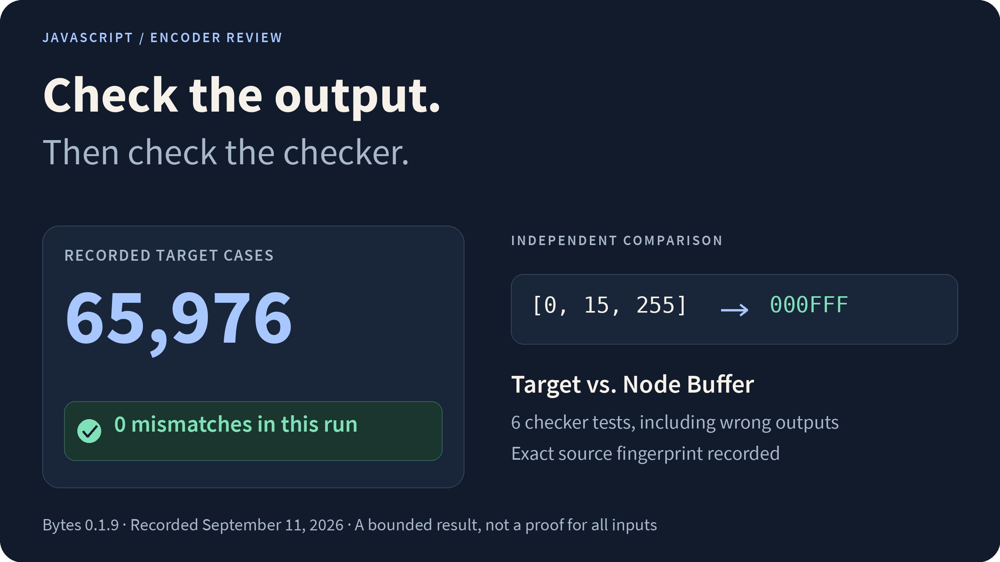

# Encoder Review

A reproducible functional check of one published byte-to-hex encoder, using an independent reference and tests for the checker itself.

<picture>
  <source media="(max-width: 600px)" srcset="docs/assets/overview-mobile.png">
  
</picture>

**[Read the recorded result](results/2026-09-11.json)** · **[Repeat the review](docs/reproduce.md)** · [Method and limits](docs/method.md)

Node.js 24+ · No npm dependencies · MIT-licensed harness

## What was checked

The target is `BytesToTextBase16` from Progsbase's **Bytes 0.1.9** JavaScript bundle. Its exact download address and SHA-256 fingerprint are in [source-record.json](source-record.json). The third-party bundle is downloaded separately.

**The September 11, 2026 run checked 65,976 cases and found zero mismatches.** The expected values came from Node's `Buffer` hex encoding, computed from a separate input copy before the target ran.

| Input group | Cases |
| --- | ---: |
| Every two-byte combination | 65,536 |
| Every single byte | 256 |
| Seeded longer arrays | 160 |
| Repeated zero or maximum byte | 20 |
| Empty input and negative zero | 2 |
| Full byte range, ascending and descending | 2 |

Longer inputs are sampled. This is a bounded result for one exact source file.

## Start with the checker tests

```sh
git clone https://github.com/jackspiece/encoder-review-example.git
cd encoder-review-example
node --test test/validator.test.cjs
```

Six tests exercise correct output, changed values, missing padding, wrong types, input mutation, exceptions and invalid inputs. Some tests contain more than one assertion.

**To run all 65,976 target cases**, follow the [reproduction steps](docs/reproduce.md) to download the pinned bundle and run `verify.cjs`.

## Find your way through the code

| File | Purpose |
| --- | --- |
| [validator.cjs](validator.cjs) | Compare one encoder call with an independent expected result. |
| [verify.cjs](verify.cjs) | Verify the source fingerprint, generate cases and save the review. |
| [test/validator.test.cjs](test/validator.test.cjs) | Check that incorrect outputs are caught. |
| [results/2026-09-11.json](results/2026-09-11.json) | The dated run, counts, seed, fingerprints and limitations. |

The [method notes](docs/method.md) explain what the controls establish and where coverage ends. No reward claim was submitted from this check.

---

Harness and review by [jackspiece](https://github.com/jackspiece). [MIT License](LICENSE) for the original code in this repository.
